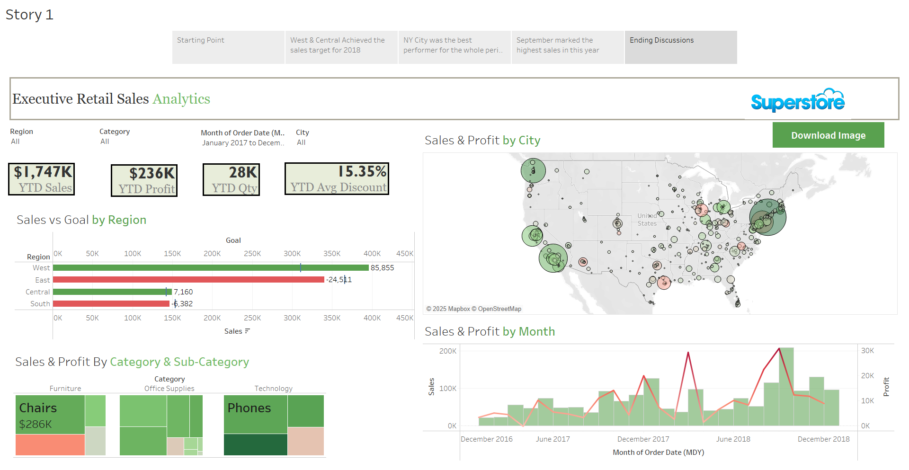

# Retail_Sales_Analysis

Tableau public = https://public.tableau.com/app/profile/prachi.lidbe/viz/Retail_Sales_DashB/Dashboard1?publish=yes

## Overview
The Executive Retail Sales Analytics Dashboard is a Tableau-based visualization designed to analyze and track retail sales performance across different regions, categories, and time periods. It provides key insights into year-to-date (YTD) sales, profit, quantity, and discount trends, helping stakeholders make data-driven decisions.

## Features
Sales & Profit Analysis: Track YTD sales, profit, and quantity with interactive visuals.

Regional Performance: Compare sales goals versus actual sales performance by region.

Category & Sub-Category Insights: Identify top-performing product categories (e.g., furniture, office supplies, technology).

Geographic Sales Trends: Visualize sales and profit distribution across different cities using a dynamic map.

Monthly Trends: Identify seasonal trends and peak sales months with interactive time-series analysis.

Custom Filters: Adjust views by region, category, order date, and city for tailored insights.

## Technology Used
Tableau: For interactive data visualization.

SQL: For data extraction and transformation (if applicable).

Excel/CSV: For data storage and preprocessing.

Mapbox: For geographic visualization.

OpenStreetMap: For location-based insights.

## Future Enhancements
1.Advanced Data Insights Predictive Analytics: Implement forecasting models to predict future sales trends using historical data.

2.Customer Segmentation: Integrate customer demographics to analyze purchasing patterns by age, gender, or location.

3.Enhanced Visualizations Drill-Down Capabilities: Enable deeper analysis by allowing users to click on regions/categories for more detailed breakdowns.

4.Dynamic Trend Analysis: Add trend lines and seasonality insights to better understand peak and slow sales periods.

5.Real-Time Data Integration Live Data Connection: Connect the dashboard to live databases for real-time updates on sales performance.

6.API Integration: Fetch external data (e.g., economic indicators, competitor prices) to provide contextual insights.

7.Performance Optimization Dashboard Speed Improvement: Optimize data queries and reduce load times for a smoother user experience.

8.Mobile-Friendly Views: Ensure compatibility with mobile devices for accessibility on the go.
